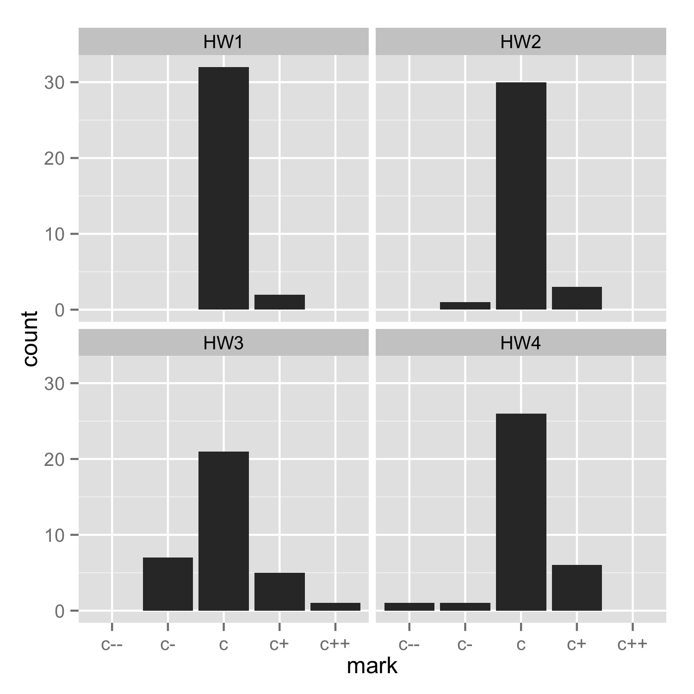
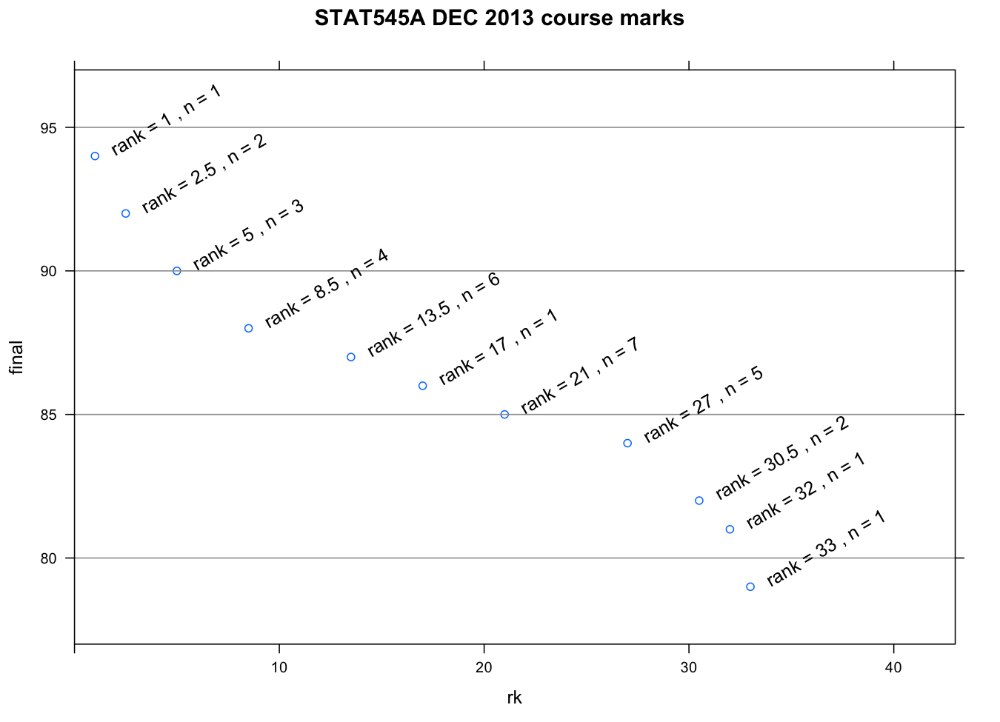
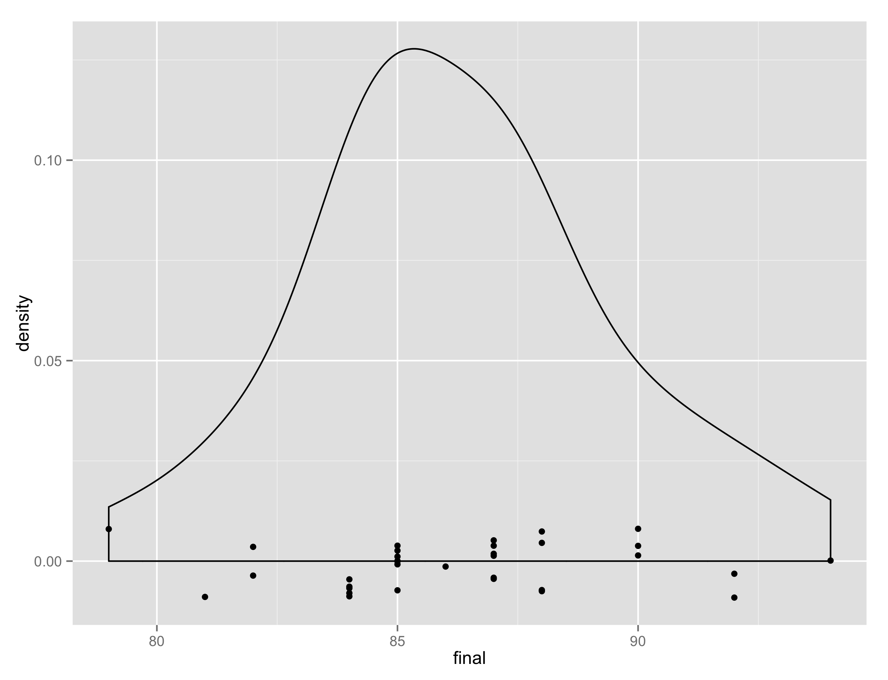

Go back to [STAT545A home](current.html)

Descriptive statistics on HW and course marks
========================================================

There were six homework assignments:

  * [HW1](hw01_compileNotebook.html) Write short R script, publish it as a Gist, compile it to an HTML notebook and publish that to RPubs
  * [HW2](hw02_rmarkdownGapminder.html) Basic intake and exploration of Gapminder data; package in an R Markdown document, publish it as a Gist, compile to HTML and publish that to RPubs
  * [HW3](hw03_dataAggregation.html) Data aggregation with `plyr` (plus usual publishing stuff)
  * [HW4](hw04_univariateLattice.html) `lattice` graphics (plus usual publishing stuff)
  * [HW5](hw05_anythingGgplot2.html) `ggplot2` graphcs (plus usual publishing stuff)
  * [HW6](hw06_puttingAllTogether.html) Build a modest, automated data exploration and visualization pipeline and publish it to web
  
Assignments were marked on a coarse scale of check minus, check, check plus. Of course, we eventually needed a larger range and used check minus minus and check plus plus. HW1 - HW4 were marked by the TA and vetted by the instructor. HW5 and HW6 were marked by TA and instructor, with instructor making final decisions. Instructor ran all the pipelines submitted for HW6. Yikes.

Here are barcharts of the HW marks for STAT545A in 2013 (typically ~34 registered students or auditors submitted work):


Coarse marks were converted to numbers like so:

+--------+--------+
| coarse | number |
| mark   |        |
+========+========+
| c--    | 76     |
+--------+--------+
| c-     | 79     |
+--------+--------+
| c      | 85     |
+--------+--------+
| c+g    | 90     |
+--------+--------+
| c+     | 93     |
+--------+--------+
| c++    | 98     |
+--------+--------+

The mark `c+g` was used only on HW6. It was "check plus, Gapminder division". This was needed to reward very strong work, while being fair to those who reached a similar level of accomplishment *with a novel dataset*.

Overall course marks were computed as a weighted average of the 6 homework assignments. Weights for HW1 and HW2 were 1. Weights for HW3, HW4, HW5, and HW6 were 3. *In case you're worried, the `weighted.mean()` function scales the weights to sum to 1!*

Here are the course marks plotted against rank. There were lots of ties. Only 33 participants completed all 6 HWs, since some auditors skipped assignments and for them no course mark was computed:


Here is a densityplot of the course marks, with actual marks depicted as dots, jittered in the y-direction:


Here are summary statistics of course marks in STAT545A in 2011, 2012, and 2013:

```
## 2013
## Min. 1st Qu.  Median    Mean 3rd Qu.    Max. 
## 79.00   84.00   86.00   86.27   88.00   94.00 

## 2012
##  Min. 1st Qu.  Median    Mean 3rd Qu.    Max.
## 81.68   83.68   89.68   83.51   91.42   92.80

## 2011
##   Min. 1st Qu.  Median    Mean 3rd Qu.    Max.
##  77.98   81.41   82.83   83.81   84.26   94.46
```

<!--
Here are links to strong student work on the homework in 2013 (a somewhat random selection among the people receiving the highest mark on a given homework ... JB may yet change these "features"):

  * [HW1](hw01_compileNotebook.html): "Compile a Notebook", publish to RPubs, post the source as a Gist
    - inskip-jes [source](https://gist.github.com/jinskip/6546533#file-stat545a-2013-hw01_inskip-jes-r) | [report](http://rpubs.com/jinskip/stat545a-2013-hw01_inskip-jes)
    - mohd abul basher-abd [source](https://gist.github.com/atante/6568482#file-stat545a-2013-hw01_mohd-abul-basher-abd-r) | [report](http://rpubs.com/meitantei/stat545a-2013-hw01_mohdabulbasher-abd)
  * [HW2](hw02_rmarkdownGapminder.html): basic intake on the Gapminder data, author a report with R Markdown, publish the report to RPubs, post the source as a Gist
    - attali-dea [source](https://gist.github.com/daattali/6547430#file-stat545a-2013-hw02_attali-dea-rmd) | [report](http://rpubs.com/daattali/stat545a-2013-hw02_attali-dea) 
    - mohd abul basher-abd [source](https://gist.github.com/atante/6568521#file-stat545a-2013-hw02_mohd-abul-basher-abd-rmd) | [report](http://rpubs.com/meitantei/stat545a-2013-hw02_mohdabulbasher-abd)
    - Christian Okkels [source](https://gist.github.com/cbokkels/6568640#file-stat545a-2013-hw02_okkels-chr-rmd) | [report](http://rpubs.com/cbokkels/stat545a-2013-hw02_okkels-chr)
  * [HW3](hw03_dataAggregation.html): data aggregation with `plyr` (and all the usual report-making and publishing)
    - hu-yum [source](https://gist.github.com/smilecat/6666754#file-stat545a-2013-hw03_hu-yum-rmd) | [report](http://rpubs.com/smilecat/stat545a-2013-hw03_hu-yum)
    - baik-jon [source](https://gist.github.com/jonnybaik/6667437#file-stat545a-2013-hw03_baik-jon-rmd) | [report](http://rpubs.com/jonnybaik/stat545a-2013-hw03_baik-jon)
  * [HW4](hw04_univariateLattice.html): `lattice` graphics
    - zhang-jon [source](https://gist.github.com/jzhang722/6759404#file-stat545a-2013-hw04_zhang-jon-rmd) | [report](http://rpubs.com/jzhang722/stat545a-2013-hw04_zhang-jon)
    - zhang-jin [source](https://gist.github.com/0527zhangjinyuan/6766491#file-stat545a-2013-hw04_zhang-jin-rmd) | [report](http://rpubs.com/zhangjinyuan/stat545a-2013-hw04_zhang-jin)
  * [HW5](hw05_anythingGgplot2.html): `ggplot` graphics
    - Dean Attali: [source](https://gist.github.com/daattali/6847430#file-stat545a-2013-hw05_attali-dea-rmd) | [report](http://rpubs.com/daattali/stat545a-2013-hw05_attali-dea)
    - Zhang, Johnathan: [source](https://gist.github.com/jzhang722/6847642#file-stat545a-2013-hw05_zhang-jon) | [report](http://rpubs.com/jzhang722/stat545a-2013-hw05_zhang-jon)
  * [HW6](hw06_puttingAllTogether.html): Build a small (semi-)automated data analysis pipeline
-->           